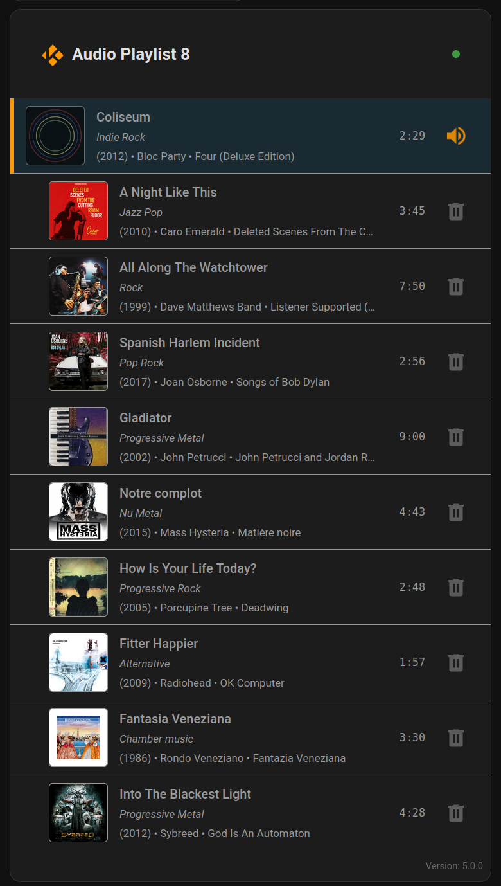
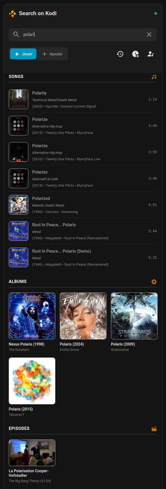

# Kodi Media Sensors for Home Assistant

[](https://github.com/jtbgroup/kodi-media-sensors)
[](https://github.com/hacs/integration)
[](LICENSE)

This Home Assistant component is used to feed custom cards like [Kodi Playlist Card](https://github.com/jtbgroup/kodi-playlist-card) or [Kodi Search Card](https://github.com/jtbgroup/kodi-search-card) with data coming from Kodi.

| Kodi playlist Card                                     | Kodi search Card                                   |
| ------------------------------------------------------ | -------------------------------------------------- |
|  |  |

## Table of Contents

- [Installation](#installation)
- [Sensors](#sensors)
- [Configuration](#configuration)
- [WebSocket Commands](#websocket-commands)
- [Issues](#issues)
- [Credits](#credits)

## Installation

### Pre-Installation

**NOTE: This component has been tested with the (almost) last versions of Home Assistant. No backward compatibility is tested. Additionally, Kodi must be setup via the UI in the integrations section of the Home Assistant configuration.**

### HACS Install

1. Search for `Kodi Media Sensors` under `Integrations` in the HACS Store tab.
2. **You will need to restart after installation for the component to start working.**

### Manual Install

**This method is not recommended**

1. In your `/config` directory, create a `custom_components` folder if one does not exist.
2. Copy the [kodi_media_sensors](https://github.com/jtbgroup/kodi-media-sensors/tree/master/custom_components) folder and all of its contents to your `custom_components` directory.
3. Restart Home Assistant.

### Integration Installation

1. After automatic or manual install, go to the Integration panel (under the Configuration section) and search for the new component by clicking on the button 'Add Integration'.
2. Enter the name for the integration on your system and choose the Kodi entity previously installed. A sensor connected to the kodi integration will become available.
3. Click Submit.
4. You should now see the sensor in Home Assistant with a status linked to your Kodi integration.

## Sensors

| Sensor name                                      | Description                                                                                                                                                                                                                                                                        |
| ------------------------------------------------ | ---------------------------------------------------------------------------------------------------------------------------------------------------------------------------------------------------------------------------------------------------------------------------------- |
| `sensor.kodi_<<name_of_your_integration>>_state` | Tracks the dynamic state of the configured Kodi instance. Exposes `extra_state_attributes` such as `config_entry_id`, `kodi_entity_id`, and `current_track`. The `current_track` attribute exposes the `id`, `type`, and optionally the `artist_id` of the currently playing item. |

## Configuration

### Configuring the Integrations

A `Configure` button will appear on the integration. Clicking this will allow you to toggle additional options.

| Option                                  | Value                                 | Description                                                                                                                           |
| --------------------------------------- | ------------------------------------- | ------------------------------------------------------------------------------------------------------------------------------------- |
| search_songs_limit                      | int<br/>[0 - 100]<br/>(default = 15)  | Limits the number of SONGS in the search result. <br/>0 means the search won't be performed for this item type.                       |
| search_albums_limit                     | int<br/>[0 - 100]<br/> (default = 10) | Limits the number of ALBUMS in the search result. <br/>0 means the search won't be performed for this item type.                      |
| search_artists_limit                    | int<br/>[0 - 100]<br/> (default = 10) | Limits the number of ARTISTS in the search result. <br/>0 means the search won't be performed for this item type.                     |
| search_movies_limit                     | int<br/>[0 - 100]<br/> (default = 5)  | Limits the number of MOVIES in the search result. <br/>0 means the search won't be performed for this item type.                      |
| search_musicvideos_limit                | int<br/>[0 - 100]<br/> (default = 5)  | Limits the number of MUSIC VIDEOS in the search result. <br/>0 means the search won't be performed for this item type.                |
| search_tvshows_limit                    | int<br/>[0 - 100]<br/> (default = 5)  | Limits the number of TVSHOWS in the search result. <br/>0 means the search won't be performed for this item type.                     |
| search_episodes_limit                   | int<br/>[0 - 100]<br/> (default = 5)  | Limits the number of EPISODES in the search result. <br/>0 means the search won't be performed for this item type.                    |
| search_channels_limit                   | int<br/>[0 - 100]<br/> (default = 10) | Limits the number of CHANNELS (TV & Radio) in the search result. <br/>0 means the search won't be performed for this item type.       |
| search_music_playlists_limit            | int<br/>[0 - 100]<br/> (default = 10) | Limits the number of music playlists retrieved by the search engine.                                                                  |
| search_recently_added_songs_limit       | int<br/>[0 - 100]<br/> (default = 20) | Limits the number of SONGS in the RECENTLY ADDED search result. <br/>0 means the search won't be performed for this item type.        |
| search_recently_added_albums_limit      | int<br/>[0 - 100]<br/> (default = 20) | Limits the number of ALBUMS in the RECENTLY ADDED search result. <br/>0 means the search won't be performed for this item type.       |
| search_recently_added_movies_limit      | int<br/>[0 - 100]<br/> (default = 20) | Limits the number of MOVIES in the RECENTLY ADDED search result. <br/>0 means the search won't be performed for this item type.       |
| search_recently_added_musicvideos_limit | int<br/>[0 - 100]<br/> (default = 20) | Limits the number of MUSIC VIDEOS in the RECENTLY ADDED search result. <br/>0 means the search won't be performed for this item type. |
| search_recently_added_episodes_limit    | int<br/>[0 - 100]<br/> (default = 20) | Include EPISODES search result in RECENTLY ADDED items.                                                                               |
| search_recently_played_songs_limit      | int<br/>[0 - 100]<br/> (default = 10) | Limits the number of SONGS in the RECENTLY PLAYED search result. <br/>0 means the search won't be performed for this item type.       |
| search_recently_played_albums_limit     | int<br/>[0 - 100]<br/> (default = 10) | Limits the number of ALBUMS in the RECENTLY PLAYED search result. <br/>0 means the search won't be performed for this item type.      |

## WebSocket Commands

In order to interact with the integration, Home Assistant WebSocket commands are used rather than standard Home Assistant services.

### **Playlist**

1. **kodi_media_sensors/playlist_subscribe**
   Subscribes to the playlist to be notified of changes in the active Kodi player.
   - `entry_id` = The entry ID of the integration.

2. **kodi_media_sensors/playlist_goto_index**
   Plays the object at the given position.
   - `entry_id` = The entry ID of the integration.
   - `index` = The 0-based index to be played.

3. **kodi_media_sensors/playlist_remove_item**
   Removes an object from the current playlist.
   - `entry_id` = The entry ID of the integration.
   - `index` = The index of the item to be removed.

4. **kodi_media_sensors/playlist_reorder**
   Moves an item by removing and re-inserting it at a new position.
   - `entry_id` = The entry ID of the integration.
   - `from_index` = The index of the item to be moved.
   - `to_index` = The target index where the item should be placed.

5. **kodi_media_sensors/playlist_play_item**
   Plays a specific item based on its type.
   - `entry_id` = The entry ID of the integration.
   - `item_id` = The ID of the item to be played.
   - `item_name` = Keyword linked to the type (e.g., "songid", "movieid", "albumid", "musicvideoid", "episodeid", "channelid", "filemusicplaylist").

6. **kodi_media_sensors/playlist_add_item**
   Adds an item to the playlist.
   - `entry_id` = The entry ID of the integration.
   - `item_id` = The ID of the item to be added.
   - `item_name` = Keyword linked to the type.
   - `position` _(optional)_ = Can be "next" or "last" (defaults to "last").

7. **kodi_media_sensors/playlist_play**
   Clears the current playlist, inserts a new directory/path, and starts playing.
   - `entry_id` = The entry ID of the integration.
   - `path` = The directory or playlist path to open.
   - `playlistid` _(optional)_ = The targeted playlist ID.

8. **kodi_media_sensors/playlist_add**
   Adds a directory/path to the current playlist without clearing it.
   - `entry_id` = The entry ID of the integration.
   - `path` = The directory or playlist path to insert.
   - `playlistid` _(optional)_ = The targeted playlist ID.
   - `position` _(optional)_ = Can be "next" or "last".

### **Search**

1. **kodi_media_sensors/search**
   Searches in the specified media type for the referenced value. The media type 'all' will return results across categories.
   - `entry_id` = The entry ID of the integration.
   - `query` = The text to search.
   - `category` _(optional)_ = The category you want to search on ("all", "movies", "tvshows", "songs", "albums", "artists", "musicvideos", "episodes", "channels").

2. **kodi_media_sensors/search_artist**
   Retrieves albums and songs for a specific artist.
   - `entry_id` = The entry ID of the integration.
   - `artist_id` = The Kodi ID of the artist.

3. **kodi_media_sensors/search_tvshow**
   Retrieves seasons and episodes for a given TV Show.
   - `entry_id` _(optional)_ = The entry ID of the integration.
   - `kodi_entity_id` _(optional)_ = The Kodi Entity ID.
   - `tvshow_id` = The Kodi ID of the TV Show.

4. **kodi_media_sensors/search_recently_played**
   Fetches recently played songs and albums.
   - `entry_id` = The entry ID of the integration.

5. **kodi_media_sensors/search_recently_added**
   Fetches all recently added media (Songs, Albums, Movies, Episodes, Music Videos).
   - `entry_id` = The entry ID of the integration.

6. **kodi_media_sensors/search_musicplaylists**
   Fetches available music playlists from a given path.
   - `entry_id` = The entry ID of the integration.
   - `path` _(optional)_ = Defaults to "special://musicplaylists".

### Cards to use with sensors

The goal is to group all the sensors and have separate Cards to display the sensors data. The cards that where tested are:

- [Kodi Playlist Card](https://github.com/jtbgroup/kodi-playlist-card)
- [Kodi Search Card](https://github.com/jtbgroup/kodi-search-card)

**Samples** for ui-lovelace.yaml:

```yaml
- type: custom:kodi-search-card
  entity: sensor.kodi_media_sensor_KODI-1
```
