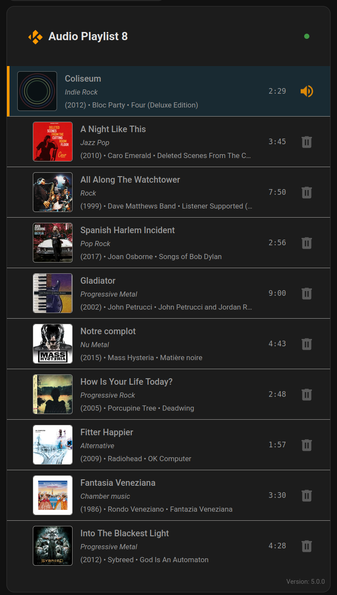
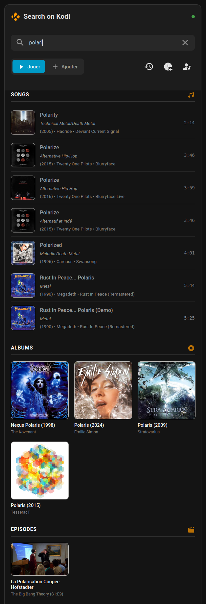

# Kodi Media Sensors for Home Assistant

[](https://github.com/jtbgroup/kodi-media-sensors)
[](https://github.com/hacs/integration)
[](LICENSE)

This Home Assistant integration provides data from Kodi to custom cards such as [Kodi Playlist Card](https://github.com/jtbgroup/kodi-playlist-card) and [Kodi Search Card](https://github.com/jtbgroup/kodi-search-card).

| Kodi playlist Card                                     | Kodi search Card                                   |
| ------------------------------------------------------ | -------------------------------------------------- |
|  |  |

## Table of Contents

- [Installation](#installation)
- [Sensors](#sensors)
- [Configuration](#configuration)
- [WebSocket Commands](#websocket-commands)
- [Support](#support)
- [Credits](#credits)

## Installation

### Pre-Installation

**NOTE: This integration is tested with recent Home Assistant versions. Backward compatibility is not guaranteed. Kodi must be configured first through the Home Assistant Integrations UI.**

### HACS Install

1. Search for `Kodi Media Sensors` under `Integrations` in the HACS Store tab.
2. **Restart Home Assistant after installation for the integration to start working.**

### Manual Install

**This method is not recommended**

1. In your `/config` directory, create a `custom_components` folder if one does not exist.
2. Copy the [kodi_media_sensors](https://github.com/jtbgroup/kodi-media-sensors/tree/master/custom_components) folder and all its contents to your `custom_components` directory.
3. Restart Home Assistant.

### Integration Installation

1. After installation, open **Settings > Devices & services**, click **Add Integration**, and search for `Kodi Media Sensors`.
2. Enter a name for the integration and select the Kodi media player entity configured previously. A sensor connected to the Kodi integration will become available.
3. Click Submit.
4. You should now see the sensor in Home Assistant with a status linked to your Kodi integration.

## Sensors

| Sensor name                                      | Description                                                                                                                                                                                                                                                                        |
| ------------------------------------------------ | ---------------------------------------------------------------------------------------------------------------------------------------------------------------------------------------------------------------------------------------------------------------------------------- |
| Sensor created by the integration | Tracks the dynamic state of the configured Kodi instance. The entity ID is generated by Home Assistant from the integration name. It exposes `config_entry_id`, `kodi_entity_id`, and, when media is playing, `current_track`. The `current_track` attribute contains the Kodi item `id`, `type`, and optionally `artist_id`. |

## Configuration

### Configuring the Integrations

A `Configure` button will appear on the integration. Clicking this will allow you to toggle additional options.

| Option                                  | Value                                 | Description                                                                                                                           |
| --------------------------------------- | ------------------------------------- | ------------------------------------------------------------------------------------------------------------------------------------- |
| search_songs_limit                      | int<br/>[0 - 30]<br/>(default = 15)  | Limits the number of songs in the search result. `0` disables this category.                       |
| search_albums_limit                     | int<br/>[0 - 30]<br/>(default = 10)  | Limits the number of albums in the search result. `0` disables this category.                      |
| search_artists_limit                    | int<br/>[0 - 30]<br/>(default = 10)  | Limits the number of artists in the search result. `0` disables this category.                     |
| search_movies_limit                     | int<br/>[0 - 30]<br/>(default = 5)   | Limits the number of movies in the search result. `0` disables this category.                      |
| search_musicvideos_limit                | int<br/>[0 - 30]<br/>(default = 10)  | Limits the number of music videos in the search result. `0` disables this category.                |
| search_tvshows_limit                    | int<br/>[0 - 30]<br/>(default = 5)   | Limits the number of TV shows in the search result. `0` disables this category.                    |
| search_episodes_limit                   | int<br/>[0 - 30]<br/>(default = 5)   | Limits the number of episodes in the search result. `0` disables this category.                   |
| search_channels_limit                   | int<br/>[0 - 30]<br/>(default = 10)  | Limits the number of TV and radio channels in the search result. `0` disables this category.       |
| search_music_playlists_limit            | int<br/>[0 - 30]<br/>(default = 10)  | Limits the number of music playlists in the search result.                                       |
| search_recently_added_songs_limit       | int<br/>[0 - 30]<br/>(default = 20)  | Limits the number of songs in the recently added results. `0` disables this category.             |
| search_recently_added_albums_limit      | int<br/>[0 - 30]<br/>(default = 20)  | Limits the number of albums in the recently added results. `0` disables this category.            |
| search_recently_added_movies_limit      | int<br/>[0 - 30]<br/>(default = 20)  | Limits the number of movies in the recently added results. `0` disables this category.            |
| search_recently_added_musicvideos_limit | int<br/>[0 - 30]<br/>(default = 20)  | Limits the number of music videos in the recently added results. `0` disables this category.      |
| search_recently_added_episodes_limit    | int<br/>[0 - 30]<br/>(default = 20)  | Limits the number of episodes in the recently added results. `0` disables this category.           |
| search_recently_played_songs_limit      | int<br/>[10 - 30]<br/>(default = 10) | Limits the number of songs in the recently played results. The minimum is `10`.                  |
| search_recently_played_albums_limit     | int<br/>[10 - 30]<br/>(default = 10) | Limits the number of albums in the recently played results. The minimum is `10`.                 |

## WebSocket Commands

The integration exposes Home Assistant WebSocket commands rather than standard Home Assistant services. The `entry_id` used by these commands is the config entry ID of `Kodi Media Sensors`.

### **Playlist**

1. **kodi_media_sensors/playlist_subscribe**
   Subscribes to the playlist to be notified of changes in the active Kodi player.
   - `entry_id` = The entry ID of the integration.

2. **kodi_media_sensors/playlist_goto_index**
   Plays the object at the given position.
   - `entry_id` = The entry ID of the integration.
   - `index` = The 0-based index to be played.

3. **kodi_media_sensors/playlist_remove_item**
   Removes an object from the current playlist.
   - `entry_id` = The entry ID of the integration.
   - `index` = The index of the item to be removed.

4. **kodi_media_sensors/playlist_reorder**
   Moves an item by removing and re-inserting it at a new position.
   - `entry_id` = The entry ID of the integration.
   - `from_index` = The index of the item to be moved.
   - `to_index` = The target index where the item should be placed.

5. **kodi_media_sensors/playlist_play_item**
   Plays a specific item based on its type.
   - `entry_id` = The entry ID of the integration.
   - `item_id` = The ID of the item to be played.
   - `item_name` = Keyword linked to the type (e.g., "songid", "movieid", "albumid", "musicvideoid", "episodeid", "channelid", "filemusicplaylist").

6. **kodi_media_sensors/playlist_add_item**
   Adds an item to the playlist.
   - `entry_id` = The entry ID of the integration.
   - `item_id` = The ID of the item to be added.
   - `item_name` = Keyword linked to the type.
   - `position` _(optional)_ = Can be "next" or "last" (defaults to "last").

7. **kodi_media_sensors/playlist_play**
   Clears the current playlist, inserts a new directory/path, and starts playing.
   - `entry_id` = The entry ID of the integration.
   - `path` = The directory or playlist path to open.
   - `playlistid` _(optional)_ = The targeted playlist ID.

8. **kodi_media_sensors/playlist_add**
   Adds a directory/path to the current playlist without clearing it.
   - `entry_id` = The entry ID of the integration.
   - `path` = The directory or playlist path to insert.
   - `playlistid` _(optional)_ = The targeted playlist ID.
   - `position` _(optional)_ = Can be "next" or "last".

### **Search**

1. **kodi_media_sensors/search**
   Searches in the specified media type for the referenced value. The media type 'all' will return results across categories.
   - `entry_id` = The entry ID of the integration.
   - `query` = The text to search.
   - `category` _(optional)_ = The category you want to search on ("all", "movies", "tvshows", "songs", "albums", "artists", "musicvideos", "episodes", "channels").

2. **kodi_media_sensors/search_artist**
   Retrieves albums and songs for a specific artist.
   - `entry_id` = The entry ID of the integration.
   - `artist_id` = The Kodi ID of the artist.

3. **kodi_media_sensors/search_tvshow**
   Retrieves seasons and episodes for a given TV Show.
   - `entry_id` _(optional)_ = The entry ID of the integration.
   - `kodi_entity_id` _(optional)_ = The Kodi Entity ID.
   - `tvshow_id` = The Kodi ID of the TV Show.

4. **kodi_media_sensors/search_recently_played**
   Fetches recently played songs and albums.
   - `entry_id` = The entry ID of the integration.

5. **kodi_media_sensors/search_recently_added**
   Fetches all recently added media (Songs, Albums, Movies, Episodes, Music Videos).
   - `entry_id` = The entry ID of the integration.

6. **kodi_media_sensors/search_musicplaylists**
   Fetches available music playlists from a given path.
   - `entry_id` = The entry ID of the integration.
   - `path` _(optional)_ = Defaults to "special://musicplaylists".

### Cards to use with sensors

The cards tested with this integration are:

- [Kodi Playlist Card](https://github.com/jtbgroup/kodi-playlist-card)
- [Kodi Search Card](https://github.com/jtbgroup/kodi-search-card)

**Samples** for ui-lovelace.yaml:

```yaml
- type: custom:kodi-search-card
   entity: sensor.kodi_<your_integration_name>
```

## Support

Please report bugs and feature requests in the [GitHub issue tracker](https://github.com/jtbgroup/kodi-media-sensors/issues).

## Credits

- [Kodi Playlist Card](https://github.com/jtbgroup/kodi-playlist-card)
- [Kodi Search Card](https://github.com/jtbgroup/kodi-search-card)
